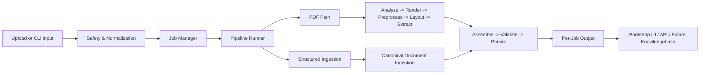
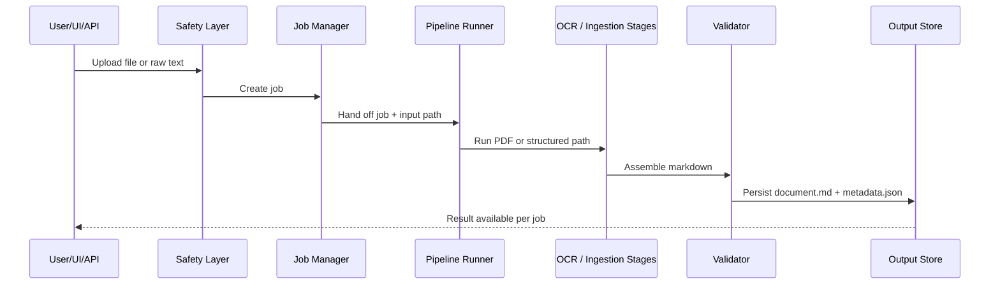

# Project Janus


A local-first OCR and document intelligence platform built for low-end hardware, structured ingestion, governed persistence, and resumable micro-task execution.

The system is designed to take many input types, normalize them into a common internal contract, process them in small safe steps, and preserve provenance so future agents and operators can continue without losing context.

## What This Platform Does

Project Janus combines OCR, vision extraction, job management, checkpointing, and a Bootstrap control plane into one coordinated system.

It is optimized around:
- low-memory execution,
- resumable document jobs,
- structured outputs,
- safe uploads,
- and future knowledgebase expansion.

## System At A Glance



## Core Design Principles

- Micro-tasks over monoliths.
- External memory over giant prompts.
- Provenance over raw text dumps.
- Governance over uncontrolled uploads.
- Per-job isolation over shared global output.
- Deterministic preprocessing before model calls.
- One canonical internal structure for all supported inputs.

## Supported Inputs

The current ingestion layer supports these source families:
- PDF and scanned PDF
- DOCX
- XLSX
- CSV and TSV
- JSON
- SQL text or raw database strings
- SQLite-like database files
- plain text and markdown
- legacy or custom text payloads via the API

## Architecture

### Runtime Flow

1. The user uploads a file through the UI, API, or CLI.
2. The safety layer rejects unsupported or risky inputs.
3. A job record is created and tracked on disk.
4. The runner chooses the PDF OCR path or the structured ingestion path.
5. Output is assembled into markdown.
6. Validation checks quality and completeness.
7. Results are stored per job and exposed back through the UI and API.

### Key Modules

| Area | Responsibility | Main Files |
|---|---|---|
| Entry points | CLI and web service bootstrap | [src/main.py](src/main.py), [src/api/server.py](src/api/server.py) |
| Pipeline | OCR flow orchestration | [src/core/pipeline_runner.py](src/core/pipeline_runner.py) |
| Ingestion | Normalization for non-PDF inputs | [src/core/document_ingestion.py](src/core/document_ingestion.py) |
| Safety | Upload screening and text sanitization | [src/security/safety.py](src/security/safety.py) |
| Jobs | Job lifecycle and persistence | [src/core/job_manager.py](src/core/job_manager.py) |
| Checkpoints | Page-level recovery | [src/core/checkpoint_manager.py](src/core/checkpoint_manager.py) |
| Models | Shared dataclass contracts | [src/models/document.py](src/models/document.py) |
| UI | Bootstrap-based control plane | [src/web/index.html](src/web/index.html), [src/web/app.js](src/web/app.js), [src/web/styles.css](src/web/styles.css) |
| RAG | Retrieval and grounded answer support | [src/rag/](src/rag) |

## Visual Pipeline



## UI

The repository now ships with a Bootstrap control plane served from the API.

It includes:
- file upload for supported document types,
- a legacy text panel for raw text and database strings,
- live job polling,
- per-job result preview,
- and download support.

## Add-Ons And Integrations

These components are already part of the repo or ready to be extended:

- Ollama for local vision model inference.
- Qdrant for vector storage in the RAG layer.
- Sentence Transformers for embeddings and reranking.
- FastAPI for service exposure.
- Bootstrap 5 for the UI layer.
- Editable package install through `pyproject.toml`.
- Pytest for regression coverage.

Suggested future add-ons:
- OCR adapter plugins for DOCX table extraction improvements.
- Spreadsheet-specific sheet and cell lineage tracking.
- Knowledgebase persistence with sensitivity tags.
- Queue-based background workers for heavier throughput.
- Document registry and provenance browser.

## Repository Layout

```text
src/
  ai/              planning, prompts, routing, model selection, context memory
  api/             FastAPI service
  config/          settings and environment configuration
  core/            orchestrator, logging, job control, checkpoints, ingestion
  evaluation/      evaluation scaffolding
  models/          shared data contracts
  multimodal/      image helpers
  observability/   metrics scaffolding
  pipeline/        PDF analysis, rendering, preprocessing, layout, extraction, assembly, validation
  rag/             chunking, embeddings, retrieval, reranking, answer generation
  security/        upload and prompt safety
  utils/           reusable helpers
  web/             Bootstrap control plane
  workers/         background worker

tests/
```

## Quick Start

### Install

```bash
pip install -e .
```

### Run Tests

```bash
python -m pytest -q
```

### Start The API

```bash
uvicorn api.server:app --reload
```

### Use The CLI

```bash
python src/main.py path/to/document.pdf
```

## Configuration Notes

- The system is intended for local execution.
- Keep secrets, keys, and environment files out of Git.
- Output is written per job under `data/output/<job_id>/`.
- Temporary data, logs, checkpoints, and generated artifacts are ignored by Git.
- The current processing model is `qwen3-vl:4b` through Ollama.

## Validation And Quality

Current repository checks:
- `pytest` passes.
- The FastAPI app imports successfully from the repository root after editable installation.
- The UI and API share the same job-aware output path.

## Roadmap

The next architecture steps should be:
1. formal knowledgebase schema and persistence,
2. richer adapters for office and tabular sources,
3. retrieval over structured outputs,
4. background queueing for long-running jobs,
5. governance policies for sensitivity and retention,
6. visual provenance and document lineage browser.

## Why This Structure Works

This repo is set up so a low-end machine can still process large, mixed document sets safely:
- each task is small,
- each result is stored,
- each job is isolated,
- and each future agent can continue from the memory note or the architecture docs without rebuilding context from scratch.

## Related Docs

- [System architecture roadmap](docs/system_architecture.md)
- [Bootstrap UI](src/web/index.html)
- [API server](src/api/server.py)
- [Pipeline runner](src/core/pipeline_runner.py)
