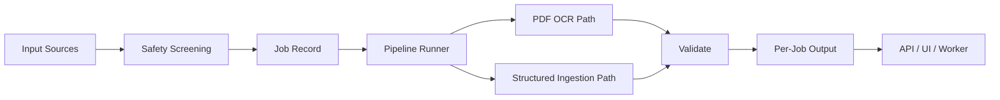
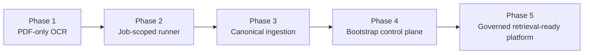

# Project Janus

<p align="left">
  
  
  
  
</p>

<p align="left">
  
  
</p>

Project Janus is a local-first document intelligence system for OCR, structured ingestion, governed persistence, and retrieval-ready document normalization.

It is built to run on constrained hardware while still supporting large and mixed document sets through deterministic preprocessing, job isolation, and typed data contracts.

## Executive Summary

The platform accepts document and data inputs, applies safety checks, routes each job through the correct processing path, and stores output per job with provenance intact.

The current system includes:
- a PDF OCR pipeline,
- a canonical ingestion layer for structured and legacy sources,
- a FastAPI service,
- a Bootstrap-based web control plane,
- job and checkpoint persistence,
- and a retrieval stack for future knowledgebase use.

## Operating Model



## System Evolution

The platform has evolved in deliberate layers rather than as a one-shot rebuild.



| Phase | Architectural shift | Outcome |
|---|---|---|
| Phase 1 | PDF analysis, rendering, extraction | Proved the core OCR path |
| Phase 2 | Job records and checkpoints | Enabled isolation and recovery |
| Phase 3 | Structured ingestion for non-PDF sources | Unified heterogeneous inputs |
| Phase 4 | Bootstrap UI and API control plane | Added operator visibility |
| Phase 5 | Governance and retrieval surface | Prepared the system for knowledgebase growth |

## System Boundaries

The repository is organized around clear runtime boundaries:

- **Entry points**: CLI and API bootstrap the same orchestration layer.
- **Core orchestration**: a single runner coordinates analysis, rendering, preprocessing, layout detection, extraction, assembly, validation, and persistence.
- **Ingestion**: non-PDF sources are normalized into the same internal contract.
- **Governance**: upload screening, secret hygiene, and per-job isolation protect the system.
- **Output**: each job owns its output directory and metadata bundle.
- **Retrieval**: the RAG subsystem exists as a separate capability for grounded access to stored content.

## Request Lifecycle

1. A user submits a file or raw text through the UI, API, or CLI.
2. The safety layer screens the payload.
3. A job record is created.
4. The runner selects the PDF OCR path or the structured ingestion path.
5. The system produces markdown output and validation metadata.
6. Results are saved under a per-job directory.
7. The UI and API read the same job-scoped output.

## Supported Sources

The current system accepts these input families:

- PDF and scanned PDF
- DOCX
- XLSX
- CSV and TSV
- JSON
- SQL text
- SQLite-like database files
- plain text and markdown
- legacy or custom payloads through the API

## Runtime Topology

| Layer | Responsibility | Main Files |
|---|---|---|
| Service Layer | HTTP API and UI delivery | [src/api/server.py](src/api/server.py), [src/web/index.html](src/web/index.html), [src/web/app.js](src/web/app.js), [src/web/styles.css](src/web/styles.css) |
| Orchestration Layer | Job-aware execution and persistence | [src/core/pipeline_runner.py](src/core/pipeline_runner.py), [src/core/job_manager.py](src/core/job_manager.py), [src/core/checkpoint_manager.py](src/core/checkpoint_manager.py) |
| Ingestion Layer | Canonical normalization for non-PDF inputs | [src/core/document_ingestion.py](src/core/document_ingestion.py) |
| OCR Layer | PDF analysis, rendering, preprocessing, layout, extraction | [src/pipeline/](src/pipeline) |
| Contract Layer | Shared dataclasses and enums | [src/models/document.py](src/models/document.py) |
| Safety Layer | File screening and prompt sanitization | [src/security/safety.py](src/security/safety.py) |
| Retrieval Layer | Chunking, embeddings, vector search, reranking | [src/rag/](src/rag) |

## Processing Paths

### PDF Path

The PDF path performs:

1. PDF analysis and metadata extraction.
2. Page rendering.
3. Image preprocessing.
4. Layout detection.
5. Vision extraction.
6. Markdown assembly.
7. Validation.
8. Per-job persistence.

### Structured Path

The structured path handles non-PDF inputs by converting them into a canonical single-document representation before assembly and validation.

That path is used for:

- office documents,
- spreadsheets,
- tabular sources,
- database exports,
- raw SQL or legacy text,
- and other non-PDF content that can be normalized safely.

## Obstacles And Design Responses

| Obstacle | Why It Matters | Design Response |
|---|---|---|
| Low-end hardware | Large prompts and broad concurrency fail quickly on constrained RAM | Keep work in micro-sized job units, persist checkpoints, and avoid unnecessary parallelism |
| Mixed input formats | PDF, DOCX, XLSX, CSV, SQLite, and raw text do not share a common representation | Normalize all sources into a canonical internal contract before assembly |
| Context loss | Vision models and long documents can lose prior state | Store outputs per job, keep provenance, and rely on external memory instead of a giant prompt |
| Unsafe uploads | Sensitive or malformed files can corrupt the pipeline | Apply safety screening, filename sanitization, and strict Git hygiene |
| Output drift | Without a stable contract, results become hard to retrieve or govern | Write markdown and metadata per job using a consistent directory layout |

## Governance And Storage

The repository treats storage as part of the architecture, not an afterthought.

Rules:
- keep secrets and environment files out of Git,
- keep generated outputs out of Git,
- keep checkpoints and temporary artifacts out of Git,
- isolate job outputs under `data/output/<job_id>/`,
- preserve metadata and provenance alongside the markdown result.

## Add-Ons And Integration Surface

Already present in the system:

- **FastAPI** for service exposure.
- **Bootstrap 5** for the operator console.
- **Ollama** for local model execution.
- **Qdrant** for vector-backed retrieval.
- **Sentence Transformers** for embeddings and reranking.
- **Pytest** for regression coverage.
- **Editable packaging** through [pyproject.toml](pyproject.toml).

## Visual Design Logic

This repository is intentionally presented like an operator-grade control surface rather than a starter project.

The current documentation style emphasizes:
- strong system hierarchy,
- visible technology identity,
- flow diagrams instead of prose-only descriptions,
- tables for architectural tradeoffs,
- and a clean separation between runtime behavior and implementation detail.

Natural extension points:

- richer DOCX table semantics,
- spreadsheet lineage and sheet provenance,
- knowledgebase persistence with sensitivity tags,
- queued background workers for throughput,
- provenance and document lineage browser,
- plugin-style adapters for new file families.

## Repository Map

```text
src/
  ai/              planning, prompts, routing, model selection, context memory
  api/             FastAPI service
  config/          settings and environment configuration
  core/            orchestrator, logging, job control, checkpoints, ingestion
  evaluation/      evaluation scaffolding
  models/          shared data contracts
  multimodal/      image helpers
  observability/   metrics scaffolding
  pipeline/        PDF analysis, rendering, preprocessing, layout, extraction, assembly, validation
  rag/             chunking, embeddings, retrieval, reranking, answer generation
  security/        upload and prompt safety
  utils/           reusable helpers
  web/             Bootstrap control plane
  workers/         background worker

tests/
docs/
```

## Validation Posture

Current checks that pass in this repository:

- `python -m pytest -q`
- FastAPI app import from the repository root after editable installation
- UI and API using the same job-scoped output contract

## Operational Start Points

### Install

```bash
pip install -e .
```

### Run The API

```bash
uvicorn api.server:app --reload
```

### Run The CLI

```bash
python src/main.py path/to/document.pdf
```

## Forward Architecture

The next system-level expansions should be:

1. a governed knowledgebase schema,
2. richer adapters for office and tabular sources,
3. retrieval over normalized outputs,
4. background queueing,
5. sensitivity and retention policy enforcement,
6. provenance browsing and lineage visualization.

## Obstacles Already Solved

- The system no longer depends on a single PDF-only path.
- The UI and API now share the same job-scoped output contract.
- The repository is installable as a package instead of relying on ad hoc module discovery.
- The runtime now has a single orchestration contract for OCR and structured sources.

## Related References

- [System architecture roadmap](docs/system_architecture.md)
- [API server](src/api/server.py)
- [Pipeline runner](src/core/pipeline_runner.py)
- [Bootstrap UI](src/web/index.html)
